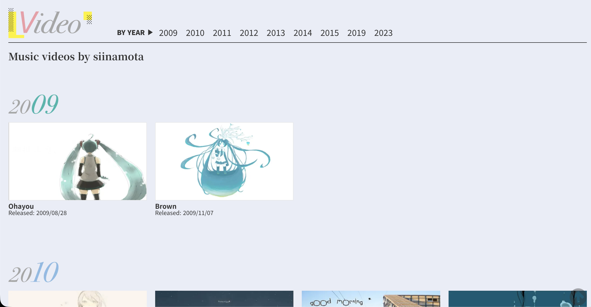

# siinamota

website tribute to siinamota  
largely inspired by [siinamota.com](https://siinamota.com/en/home)  

## Color Choice

Siinamota's aesthetics mixes the frantic and nostalgic energy of adolescene with the vivd and glitchy themes of his music. For this reason muted and desaturated tones fit most.

## Videos

Videos section inspired by [siinamota.com](https://siinamota.com/en/video) 

